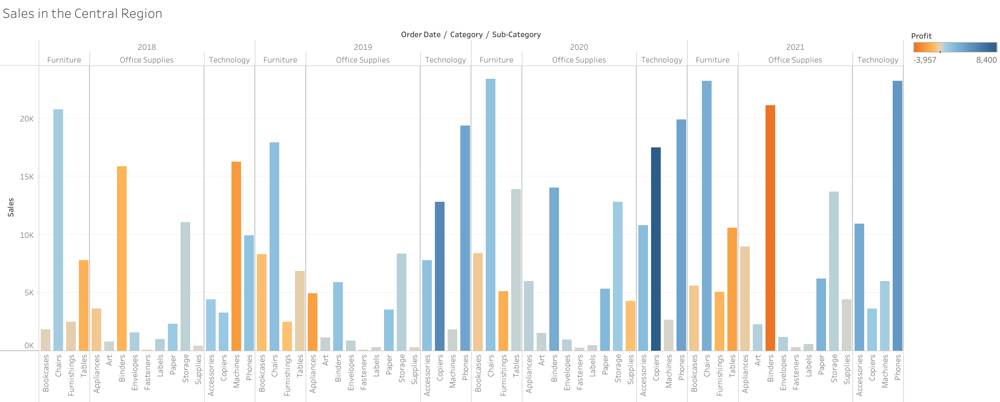
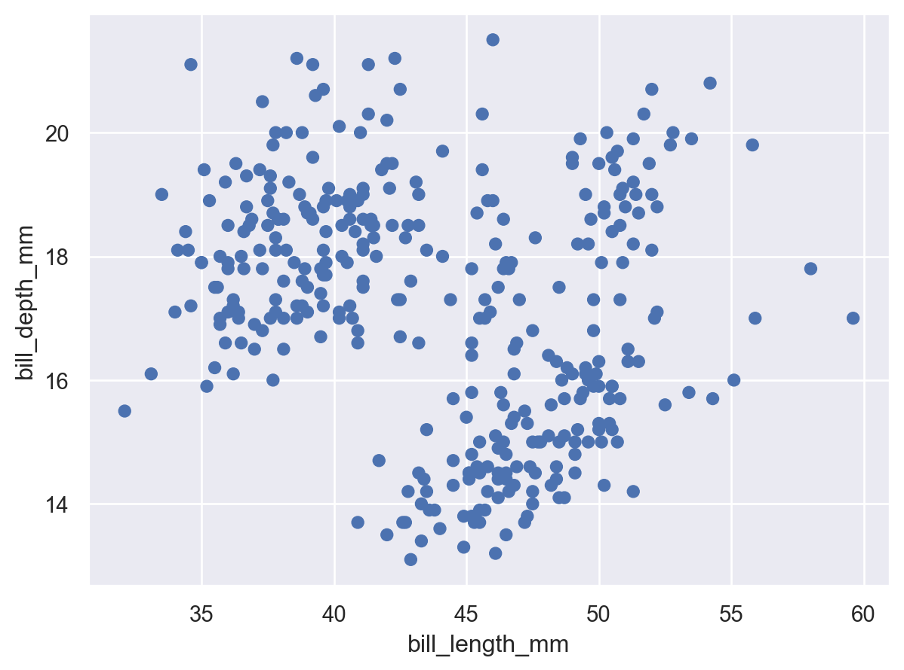
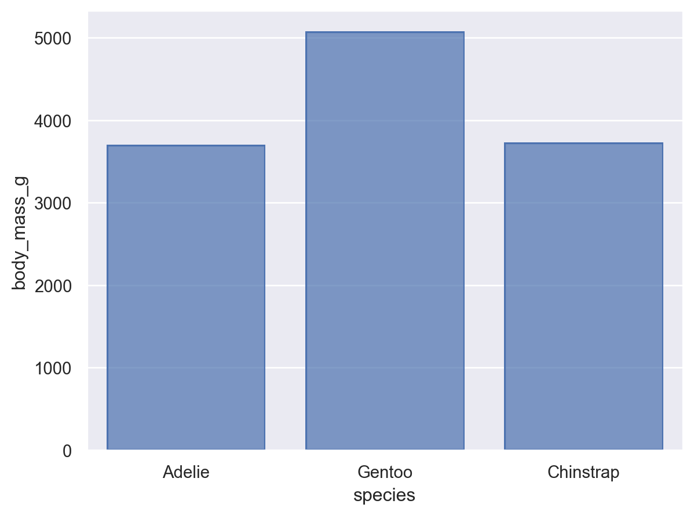
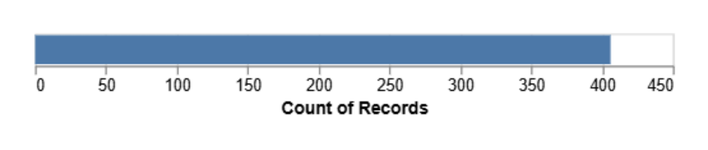

# Homework 1: Tool Setup

**Insert Your Name Here**  
CS 625, Spring 2026  
Due: Sunday, February 8, 2026

## Git, GitHub

### Q1 - URL of GitHub Repo

[https://github.com/isaacruano713/odu-cs625-datavis-spring26-bhanuka-isaacruano713/tree/main](https://github.com/isaacruano713/odu-cs625-datavis-spring26-bhanuka-isaacruano713/tree/main)

### Q2 - Pull Command

The pull command sends remote changes to local.

### Q3 - Local Commits

If you committed a change locally but do not see it update on GitHub.com, that is because you did not push the commit. The change has not been shared with GitHub.

## Markdown

### Q1 - Bulleted List

* Eggs
* Bacon
* Grits
* Sausage

The is different from a numbered list because numbered list use numbers, letters, or numerals, or other ordered symbols instead of bullets to list out the items and give a sense of ordering to the items.

1. Wake up
2. Eat breakfast
3. Eat lunch
4. Eat dinner
5. Go to sleep

### Q2 - Markdown Paragraph

I remember the *dark*, *cold* night when the great **bad** attacked. I was tucked in bed, dead asleep, when the sound awoke me. _**Clickety Clackety**_, the nails of the creature tapped against the floor as it drew closer. I flashed open my eyes as soon as I heard it coming, but it was too late. The `creature` jumped on my bed and went straight for my face! And then he sniffed my, licked my face, and curled up before falling asleep with me. Happy that my dog was now by my side, I fell back [asleep](https://paw-tastic-walks.com/wp-content/uploads/2025/12/Dog-Sleeping-Next-to-You-at-Night-1.jpg).

### Q3 - Animal Image

## Tableau

### Q1 - Region Other Than the South

## Google Colab

### Q1 - URL of Google Colab Notebook

[https://colab.research.google.com/drive/1P9pXF9fez5icpA9l57rACp5A8OyG1mzY?usp=drive_link](https://colab.research.google.com/drive/1P9pXF9fez5icpA9l57rACp5A8OyG1mzY?usp=drive_link)

## Python/Seaborn

### Q1 - First Penguin Image

This first plot is a scatterplot of the bill depth in millimeters vs the bill length. In the plot, it appears that there are three clusters, and within each cluster, there is a weak positive linear correlation between the bill depth and the bill length.

### Q2 - Second Penguin Image

This second plot is a bar plot of the average mass of each species of penguin. It appears that the Gentoo species tends to be quite a bit larger than the other two, but the other two species are very close in average mass.

### Q3 - Outer Parenthesis

When you remove the parentheses, you get a syntax error. You get this error because Python assumes that the first line of code is finished if there are no parentheses to indicate that the code should continue onto the next line. Because of this, Python reads the second line as something incomplete.

## Observable and Vega-Lite

### Q1 - markCircle to markSquare

The shape of the marks on the scatterplot changed from a circle to a square.

### Q2 - markCircle to markPoint

The marks changed from filled in circles to empty circles.

### Q3 - Swap X and Y Axes on Scatterplot

To swap the X and Y axes in the scatterplot, you can swap the fields placed inside the last parentheses in `vl.x().fieldQ()` and `vl.y().fieldQ()`. It should now be `vl.x().fieldQ("Miles_per_gallon")` and `vl.y().fieldQ("Horsepower")`.

### Q4 - Remove fieldN(Origin)

This chart is the result of the code change because when the origin field was removed, there no longer was a field to group the data by. Since none of the data is grouped, the whole data set was used. Since all the data was aggregated by caculating the count, there was only one resulting number, which should be equal to the total number of rows in the data set.

## References

*Every report must include a References section that lists the webpages and URLs that you consulted while completing the assignment. Replace the items below with the references you consulted - these are just examples.* ***Everyone will use some reference to complete these assignments (even I would). You will lose points on your assignment if you do not include the references you used.***

* ChatGPT: "If you have committed a change on your local machine, but do not see the update on GitHub.com, what step might have you forgotten?" <https://chatgpt.com/?utm_source=google&utm_medium=paid_search&utm_campaign=GOOG_C_SEM_GBR_Core_CHT_BAU_ACQ_PER_MIX_ALL_NAMER_US_EN_091724&c_id=21714513245&c_agid=169187630042&c_crid=713941893301&c_kwid={keywordid}&c_ims=&c_pms=9195561&c_nw=g&c_dvc=c&gad_source=1&gad_campaignid=21714513245&gbraid=0AAAAA-I0E5d_0LeOD-6zhv7MsKdmZ_NzS&gclid=Cj0KCQiAhaHMBhD2ARIsAPAU_D5yun8mQ8cAPYcflwLT7bZutGnQLv3Em6VFhpRVMgwYXyLOdWtcZmQaAiKFEALw_wcB>
